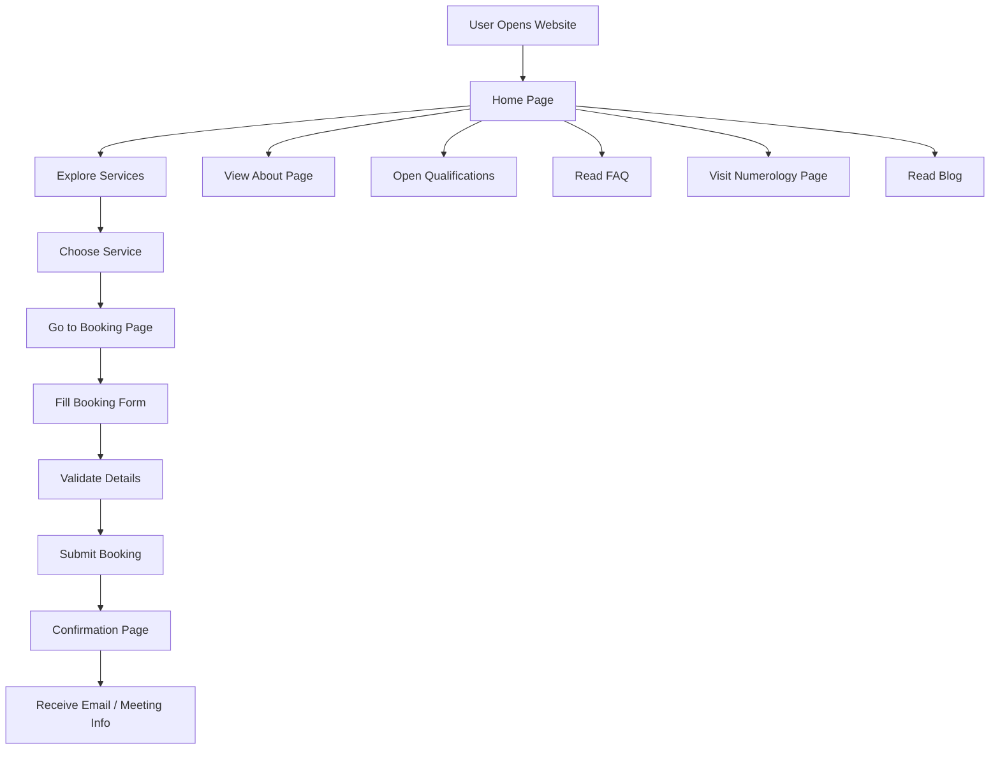
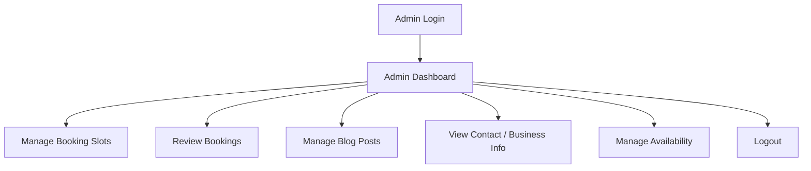
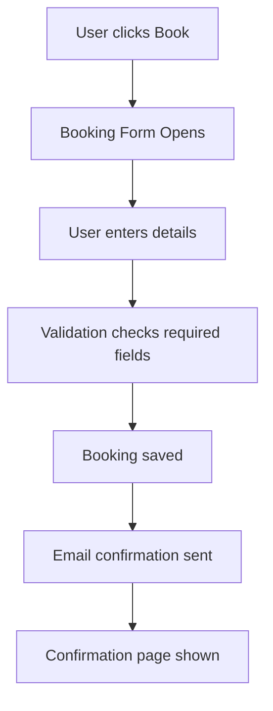
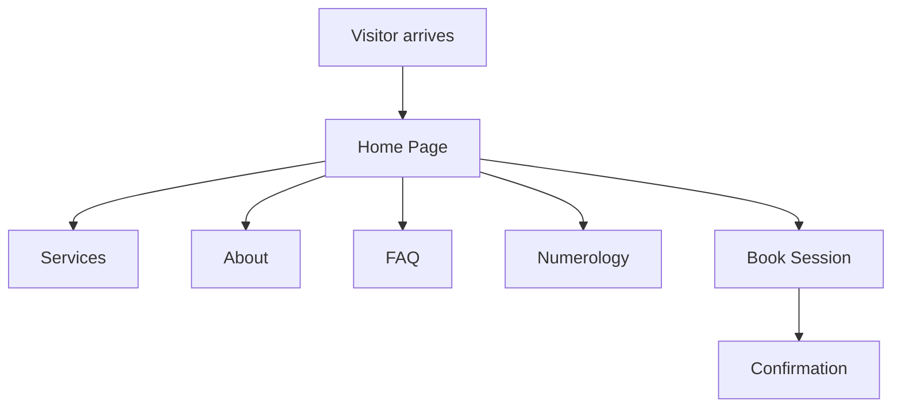
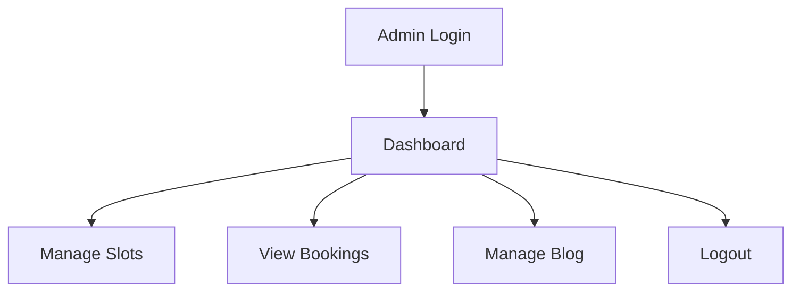
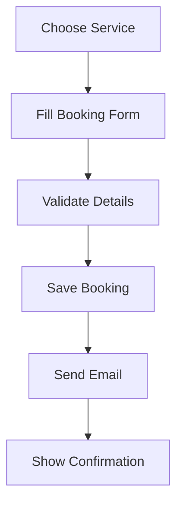
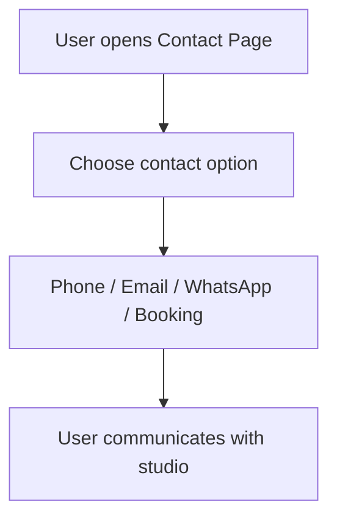
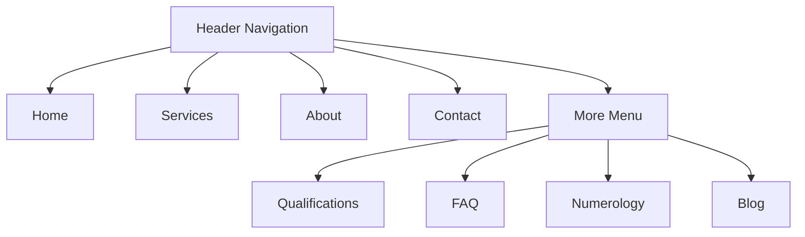
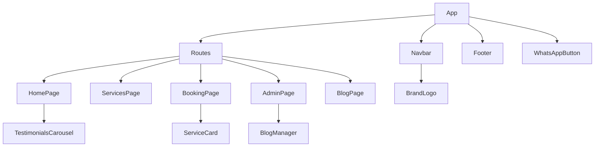
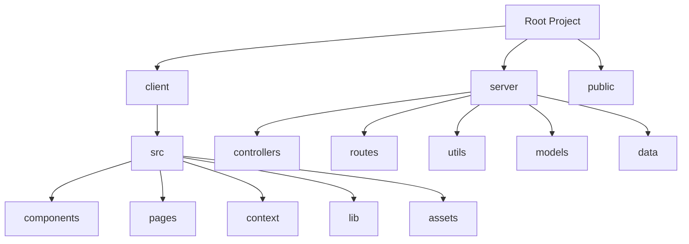

# Project Documentation

## 1. Project Overview

### What this application is
MysticVeda is a modern, full-stack wellness and booking website for MysticVeda Holistic Studio. It helps visitors explore spiritual and healing services, learn about the practitioner, read FAQs, understand numerology, and book sessions online.

### Who it is built for
This project is built for:
- Clients who want to book services online
- Business owners who want a professional web presence
- Admin users who manage bookings and blog content
- Developers who need a clear example of a React + Node.js web app

### Main purpose
The main purpose of the website is to make the studio easy to discover, understand, and book from online. It combines:
- Beautiful presentation
- Service discovery
- Booking flow
- Admin controls
- Basic content management

### Technologies used

#### Frontend
- React
- Vite
- React Router
- Tailwind CSS
- Framer Motion
- React Helmet Async

#### Backend
- Node.js
- Express.js
- MongoDB with Mongoose
- JSON file fallback for local/demo use

#### Other tools
- Nodemailer for emails
- Google APIs for meeting link creation
- CORS and dotenv support

---

## 2. User Flow (Flow Chart)

### High-level user flow


### ASCII version
```text
User Opens Website
        ↓
   Home Page
        ↓
  Explore Services / About / FAQ / Blog / Numerology
        ↓
   Choose a service
        ↓
  Booking Form
        ↓
  Enter name, email, phone, date, time
        ↓
  Submit Booking
        ↓
 Confirmation Page
        ↓
Email / Meeting details shown
```

### Step-by-step explanation

1. User opens the website
   - The user lands on the home page.
   - They see the brand, services, testimonials, and calls to action.

2. User explores content
   - The user can click through services, about, qualifications, FAQ, numerology, and blog pages.
   - Each page gives more information about the studio and its offerings.

3. User chooses a service
   - The user clicks a service card.
   - They are taken to the booking experience.

4. User fills the booking form
   - The user provides their name, email, phone, date, and time slot if needed.
   - Some services require a live meeting and some are report-only.

5. User submits booking
   - The system validates the form.
   - If the booking is valid, it is saved and the user is redirected to a confirmation page.

6. User sees confirmation
   - The confirmation page shows the booking details.
   - The user can also see meeting information or delivery status.

7. User receives communication
   - The system may send an email confirmation.
   - Live bookings may also create a meeting link.

---

## 3. Admin Flow (Ideal Admin Flow)

### Admin flow diagram


### ASCII version
```text
Admin Login
   ↓
Admin Dashboard
   ↓
Manage Slots / Review Bookings / Manage Blog / Logout
```

### Admin features explained simply

1. Admin login
   - Admin uses a secure login page.
   - Only the correct admin credentials can access the dashboard.

2. Manage booking slots
   - The admin controls the time slots that clients can choose.
   - This prevents double booking.

3. Review bookings
   - The admin can see all bookings made by clients.
   - The dashboard shows names, contact info, service, date, time, and status.

4. Manage blog content
   - The admin can add, edit, and delete blog posts.
   - Those posts appear on the public blog page.

5. View business info
   - The admin can review the studio’s public business details and service structure.

6. Logout
   - The admin can safely exit the dashboard.

> Note: The current project already includes an admin dashboard and blog management area, but it is still fairly simple compared with a full business management platform.

---

## 4. Complete Website Flow

### Home Page
**Purpose**
- Introduce the studio and make a strong first impression.

**Components**
- Hero section
- Service highlights
- About section
- Testimonials
- CTA buttons

**Buttons**
- Book Your Session
- Learn More

**Actions**
- User can explore services or navigate to the booking journey.

**Navigation**
- Linked to Services, About, Contact, and Booking-related pages.

**Possible user journey**
- A visitor arrives, reads the page, and chooses to book or explore further.

### Services Page
**Purpose**
- Show available services in a clear and polished way.

**Components**
- Service cards
- Service descriptions
- Booking buttons

**Buttons**
- Book Session
- Learn More

**Actions**
- User can choose a service and move into the booking flow.

**Navigation**
- Links to the booking page for each service.

### About Page
**Purpose**
- Explain who the practitioner is and what the studio represents.

**Components**
- Practitioner profile
- Background and qualifications
- Approach section

**Buttons**
- View qualifications and certificates

**Actions**
- User learns about the studio’s values and methodology.

### Qualifications Page
**Purpose**
- Display training, certifications, and learning background.

**Components**
- Certificate cards
- Certificate preview modal
- Professional highlights

**Buttons**
- View Certificate

**Actions**
- User can inspect qualification details visually.

### FAQ Page
**Purpose**
- Answer common questions before a booking is made.

**Components**
- Accordion FAQ items

**Buttons**
- Expand / collapse answers

**Actions**
- User can quickly find answers to common concerns.

### Contact Page
**Purpose**
- Share contact details and business information.

**Components**
- Contact cards
- WhatsApp link
- Business hours

**Buttons**
- WhatsApp Now
- Google Calendar Booking

**Actions**
- User can contact the studio or learn more about availability.

### Blog Page
**Purpose**
- Share articles, insights, and spiritual content.

**Components**
- Blog cards
- Post details

**Buttons**
- Read more

**Actions**
- User can read individual blog posts.

### Numerology Page
**Purpose**
- Let users calculate numerology insights using their name, date of birth, or phone number.

**Components**
- Numerology calculator tabs
- Input fields
- Result cards

**Buttons**
- Calculate
- Reset

**Actions**
- User enters information and receives a numerology reading display.

### Booking Page
**Purpose**
- Collect booking information and reserve a session.

**Components**
- Service summary
- Booking form
- Date picker
- Time slot selector

**Buttons**
- Book Slot

**Actions**
- User submits their booking request.

### Confirmation Page
**Purpose**
- Show the final booking details after the reservation is successful.

**Components**
- Booking summary
- Meeting link information
- Next-step buttons

**Actions**
- User can view confirmation or return to another page.

### Privacy Policy / Terms / Disclaimer / Refund / Cancellation
**Purpose**
- Provide essential legal and policy information.

**Components**
- Policy text sections

**Actions**
- User can review the studio’s terms and policies.

---

## 5. Feature List

| Feature | Purpose | How it works | Benefits | Pages used |
|---|---|---|---|---|
| Premium landing page | Introduce the brand | Uses hero sections, testimonials, and content blocks | Builds trust and visual appeal | Home |
| Service listing | Show available services | Services are loaded and displayed in cards | Easy browsing | Services |
| Booking flow | Allow users to reserve sessions | User enters details and submits | Makes online booking possible | Booking |
| Authentication | Separate admin and user access | Local storage-based login and signup | Protects private areas | Login, Signup, Admin Login |
| Protected routes | Limit access to private pages | Routes check user role | Improves security | Admin, Profile, Booking |
| Profile page | Show user bookings | Pulls user-specific bookings | Makes booking history accessible | Profile |
| Admin dashboard | Review bookings and availability | Admin views appointments and controls slots | Helps manage the business | Admin |
| Blog management | Publish and edit blog posts | Admin creates content from a form | Supports content marketing | Admin, Blog |
| Numerology calculator | Let users explore numerology | User enters name, DOB, or phone and sees results | Adds interactive value | Numerology |
| FAQ accordion | Answer common questions | User expands each item | Improves clarity and UX | FAQ |
| Contact information | Help visitors reach the studio | Contact details and business hours are displayed | Makes communication simple | Contact |
| Certificate gallery | Show practitioner qualifications | Certificates are listed and previewed | Builds credibility | Qualifications |
| WhatsApp button | Quick communication shortcut | External WhatsApp link | Helps users contact quickly | Global |
| SEO integration | Improve search visibility | SEO component adds metadata and schema markup | Better discoverability | All public pages |

---

## 6. Components

| Component | Purpose | Props | Where used |
|---|---|---|---|
| Navbar | Main website navigation | None | All pages |
| Footer | Bottom navigation and site links | None | All pages |
| BrandLogo | Displays the studio logo | compact | Navbar, Footer |
| ServiceCard | Displays one service on the services page | service | ServicesPage |
| SectionHeading | Reusable heading block for page sections | eyebrow, title, description, align | Many pages |
| FAQAccordion | Reusable FAQ list | None | FAQPage, HomePage |
| TestimonialsCarousel | Shows client testimonials | None | HomePage |
| AuthCard | Shared visual layout for login/signup/admin forms | eyebrow, title, description, footer, children | LoginPage, SignupPage, AdminLoginPage |
| ProtectedRoute | Protects pages based on user role | allow, children | App routing |
| CertificatePreviewModal | Shows certificate details in modal form | certificate, onClose | QualificationsPage |
| BlogManager | Admin blog creation/edit/delete UI | None | AdminPage |
| SEO | Adds page metadata and structured data | title, description, path, image, keywords | Public pages |
| WhatsAppButton | Quick contact button | None | Global |

---

## 7. Routing

| Route | Purpose |
|---|---|
| / | Home |
| /services | Services |
| /about | About |
| /qualifications | Qualifications |
| /faq | FAQ |
| /contact | Contact |
| /numerology | Numerology |
| /blog | Blog |
| /blog/:slug | Blog post detail |
| /custom-session | Custom session builder |
| /login | User login |
| /signup | User signup |
| /profile | User profile and bookings |
| /book/:serviceId | Booking page |
| /confirmation/:bookingId | Booking confirmation |
| /admin/login | Admin login |
| /admin | Admin dashboard |
| /privacy-policy | Privacy policy |
| /terms-and-conditions | Terms and conditions |
| /refund-policy | Refund policy |
| /cancellation-policy | Cancellation policy |
| /disclaimer | Disclaimer |

---

## 8. Folder Structure

### Client folder
**Purpose:** Contains the frontend React application.

- src/components
  - Reusable UI building blocks such as navigation, footer, cards, modals, and forms.
- src/pages
  - Full page-level components for each route.
- src/context
  - Shared state and authentication logic.
- src/lib
  - Shared constants, API helpers, and utilities.
- src/assets
  - Images and certificate assets.
- src/index.css
  - Main styling and Tailwind setup.

### Server folder
**Purpose:** Contains the backend Express API.

- src/controllers
  - Business logic for bookings, email, availability, and blog operations.
- src/routes
  - API routes for each feature area.
- src/utils
  - Helpers such as email sending, meeting generation, and local JSON storage.
- src/models
  - Mongoose models for database-backed data.
- src/data
  - Static service data.
- src/config
  - Database connection setup.

### Public folder
**Purpose:** Stores public assets and built frontend output for deployment.

### Root folder
**Purpose:** Holds project-level setup files and build configuration.

---

## 9. Booking Flow

### Booking step-by-step


### Simple explanation
1. User clicks Book on a service card.
2. The booking form opens.
3. The user enters name, email, phone, date, and time slot if needed.
4. The app validates the data.
5. The booking is saved in the system.
6. The confirmation page appears.
7. The system may send an email and create a meeting link.

---

## 10. Contact Flow

### What happens after contact form submission
The current project does not have a traditional contact form submission backend. Instead, the contact page gives clear contact actions such as:
- Calling by phone
- Sending an email
- Opening WhatsApp
- Visiting a booking or calendar link

### In simple terms
When a user visits the Contact page:
1. They see the available contact options.
2. They can choose WhatsApp, email, phone, or booking.
3. The action opens the relevant communication channel.
4. The studio can respond directly to the user.

> If a full contact form is needed in the future, this is a good place to add server-side submission and storage.

---

## 11. Data Flow

### Where data comes from
- Service data comes from the server-side service list.
- Booking data comes from the booking form and is stored in the backend.
- Blog data comes from the admin-managed blog system.
- Availability data controls which time slots are offered to clients.

### How data moves
1. The frontend sends requests to the backend API.
2. The backend validates the data.
3. The backend stores it locally or in MongoDB.
4. The frontend fetches the updated data and displays it.

### How forms work
- Forms are handled with React state.
- On submit, the data is sent to the backend API.
- The UI then reacts to the server response.

### How state is managed
- Local component state is used for form input and page behavior.
- Context is used for authentication and current user state.
- The backend uses persistent storage for bookings and blogs.

### How APIs work
- The frontend uses a central API helper.
- The API helper makes fetch requests to backend endpoints.
- The server returns JSON responses that the frontend uses to update the UI.

---

## 12. Future Improvements

Here are useful improvements for the future:

- Admin dashboard improvements
  - More detailed booking analytics
  - Better booking filtering

- CMS improvements
  - Add a richer blog editor
  - Allow image uploads

- Client portal
  - Let clients manage their own appointments

- Payments
  - Add online payment support

- Email notifications
  - Improve reminder emails and follow-ups

- Analytics
  - Track page visits and booking conversion

- Calendar integration
  - Better sync with Google Calendar

- Authentication improvements
  - Add stronger security and password reset support

- Booking management
  - Add cancellation and rescheduling tools

---

## 13. Code Review

### Strengths
- Clean and modern UI
- Clear separation between frontend and backend
- Good use of reusable components
- Nice SEO support
- Good booking and admin workflow foundation

### Weaknesses
- Some features are still simple and not fully production-ready
- The admin panel is basic
- Contact form submission is not yet a full backend form flow
- Some parts rely on local fallback data instead of a full database setup

### Performance
- The site is fairly lightweight for a React app.
- Image loading is mostly handled with lazy loading.
- Performance is good for a small to medium business website.

### Accessibility
- The project uses semantic structure and ARIA-friendly buttons in some places.
- There is room to improve keyboard navigation and form accessibility further.

### SEO
- The project has good SEO support through the SEO component.
- Metadata, canonical URLs, and schema markup are already included.

### Maintainability
- The project is generally easy to follow because the folder structure is organized.
- Reusable components help reduce repetition.

### Duplicate code
- Some repeating UI patterns and card layouts exist, but they are not excessive.

### Unused files
- Some files may be present but not heavily used in the current flow.
- A future cleanup could remove old or unused components if needed.

### Possible improvements
- Add stronger validation
- Improve test coverage
- Improve accessibility further
- Add documentation for each feature area

---

## 14. Project Summary

### Completion percentage
This project is approximately 80% complete for a polished business website and booking system.

### Architecture review
The architecture is solid for a small to medium-scale service business website. It is split into:
- Frontend UI
- Backend API
- Storage layer
- Email and meeting integration

### Current features
- Premium website design
- Service pages
- Booking flow
- User authentication
- Admin dashboard
- Blog management
- Numerology tools
- SEO setup

### Missing features
- Full payment system
- Advanced admin reporting
- Better client portal
- Full contact form backend
- More advanced analytics

### Recommendations
- Add a stronger admin dashboard
- Add a real contact form workflow
- Add payment support
- Improve accessibility and testing
- Add more robust booking management

---

## 15. Visual Diagrams

### User Flow Diagram


### Admin Flow Diagram


### Booking Flow Diagram


### Contact Flow Diagram


### Navigation Structure Diagram


### Component Relationship Diagram


### Folder Structure Diagram


---

## Final Note

MysticVeda is a polished, wellness-oriented website that combines branding, storytelling, booking, and content management into one experience. It is suitable for a healing studio or spiritual business that wants to offer online services in a calm and professional way.

This documentation is written to help new developers, business owners, clients, and non-technical readers understand the project clearly without needing to read the source code first.
